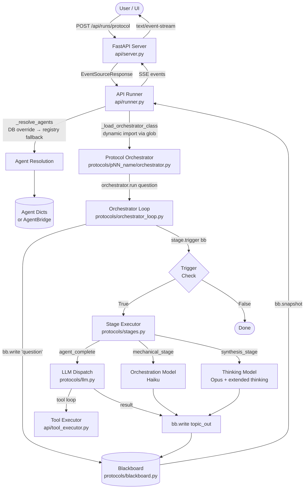
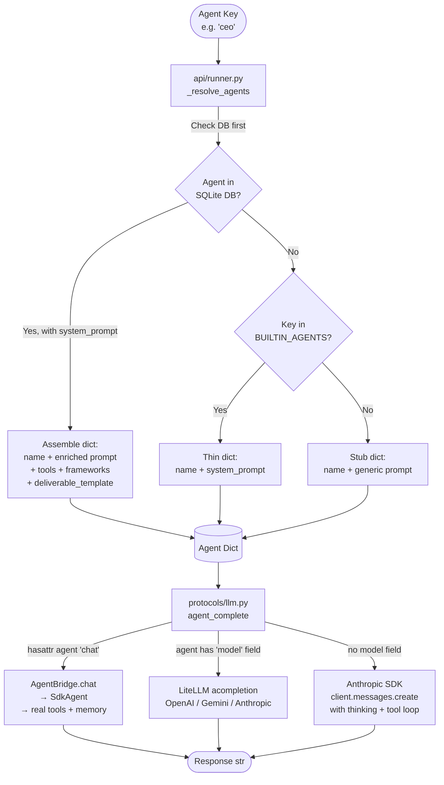

# CE Multi-Agent Orchestration — Architecture

## Data Flow



## Dual-Mode Agent Resolution



**Production mode** (`protocols/agent_provider.py`): `build_production_agents()` wraps each `SdkAgent` (from CE - Agent Builder) in an `AgentBridge`. The bridge exposes `chat()`, which `agent_complete()` detects via `hasattr(agent, "chat")` and routes directly to the SDK agent with full tools, Pinecone memory, and DuckDB learning.

**Research mode** (default for CLI): Agents are plain dicts. The runner still enriches them from the DB when available.

---

## Protocol Pattern

Every protocol lives in `protocols/p{NN}_{name}/` and consists of:

- `orchestrator.py` — async class with `run(question) -> *Result`. Constructs a `ProtocolDef` (list of `Stage` objects) and hands it to `Orchestrator.run()`.
- `prompts.py` — all prompt templates as string constants.
- `run.py` — CLI entry point.
- `protocol_def.py` (newer protocols) — the `ProtocolDef` extracted for reuse.

The `Orchestrator` (`protocols/orchestrator_loop.py`) is a pure state machine:

```python
while pending:
    fired = []
    for stage in pending:
        if stage.trigger(bb):           # check blackboard state
            await stage.execute(bb, agents, **config)
            fired.append(stage)
    if not fired:
        break  # done or deadlocked
```

`Stage.trigger` is a callable `(Blackboard) -> bool`. Common trigger: `lambda bb: bb.has_topic("question")`. Stages fire once their preconditions are written to the blackboard by an earlier stage.

The `api/runner.py` discovers orchestrators dynamically by globbing `protocols/p*/orchestrator.py` and regex-matching the class name (e.g., `class TRIZOrchestrator`).

---

## Blackboard Pattern

`Blackboard` (`protocols/blackboard.py`) is the shared, append-only state store for a single protocol run.

Key properties:
- **Append-only**: `write()` never overwrites; every write creates a versioned `BlackboardEntry`.
- **Topic-keyed**: entries are namespaced by `topic` string (e.g., `"question"`, `"perspectives"`, `"synthesis"`).
- **Role-scoped reads**: `read(topic, reader=agent_dict)` filters entries by the reader's `context_scope` field — used in protocols like Red/Blue Team where teams should not see each other's reasoning.
- **Watcher callbacks**: `on_write(cb)` enables real-time observation without coupling the orchestrator to stage internals.
- **Resource signals**: `resource_signals()` returns aggregated token counts and wall-clock elapsed for cost tracking.

Serialization: `snapshot()` returns a full dict; `to_jsonl(path)` appends an event log.

---

## Cognitive Tiers

Defined in `protocols/config.py`. Four levels map stage types to models, inspired by CogRouter (arXiv:2602.12662):

| Tier | Model | Stage Types | Purpose |
|------|-------|-------------|---------|
| L1 | `claude-haiku-4-5-20251001` | dedup, classify, extract, format, parse | Fast pattern matching |
| L2 | `claude-haiku-4-5-20251001` | score, rank, filter, vote, matrix | Rule-based evaluation |
| L3 | `claude-sonnet-4-6` | assess, compare, analyze, evaluate | Structured analytical reasoning |
| L4 | `claude-opus-4-6` | synthesize, ideate, debate, reframe, generate | Creative and strategic synthesis |

Usage in an orchestrator:
```python
from protocols.config import model_for_stage, COGNITIVE_TIERS
model = model_for_stage("rank")        # → Haiku (L2)
model = model_for_stage("synthesize")  # → Opus (L4)
model = COGNITIVE_TIERS["L3"]          # → Sonnet directly
```

The stage executor functions in `protocols/stages.py` accept `thinking_model` and `orchestration_model` from the caller's `**config`:
- `parallel_agent_stage`, `sequential_agent_stage`, `multi_round_stage`, `synthesis_stage` — use `thinking_model` (Opus + extended thinking).
- `mechanical_stage` — uses `orchestration_model` (Haiku, no thinking).
- `compute_stage` — pure Python, no LLM call.

---

## LLM Dispatch (`protocols/llm.py`)

`agent_complete()` is the single entry point for all agent LLM calls. Resolution order:

1. If `agent` has a `.chat()` method → `AgentBridge` → `SdkAgent` (production path).
2. If `agent["model"]` is set → `litellm.acompletion` (multi-provider: Gemini, GPT, Anthropic via LiteLLM).
3. Otherwise → `anthropic.AsyncAnthropic.messages.create` with extended thinking and an agentic tool loop (up to `MAX_TOOL_ITERATIONS` iterations).

Retries: all API calls go through `_retry_api_call()` with three retries on `RateLimitError`, `APIConnectionError`, and `5xx` errors. Backoff schedule: 1 s, 2 s, 4 s plus up to 0.5 s jitter.

Live tool visibility: `set_event_queue(queue)` injects an `asyncio.Queue` into the `contextvars` context. Every `tool_call` and `tool_result` event is pushed to this queue; the runner drains it and emits SSE events while the orchestrator task runs concurrently.

---

## Agent Dispatch Mechanism

`agent_complete()` in `protocols/llm.py` (line ~168) is the single gateway for every agent LLM call. It uses a three-path dispatch based on runtime inspection of the agent object.

### Decision Tree

```
agent object received by agent_complete()
│
├─ hasattr(agent, "chat") and callable(agent.chat)?
│  YES → Production path: await agent.chat(message)
│        AgentBridge wraps SdkAgent → full tools, MCP servers,
│        Pinecone memory, DuckDB learning. The LLM dispatch
│        layer is bypassed entirely; the SDK agent handles its
│        own model calls and tool loops internally.
│
├─ agent["model"] is set?
│  YES → LiteLLM path: litellm.acompletion(model=agent["model"], ...)
│        Supports any provider LiteLLM knows (OpenAI, Gemini,
│        Anthropic). Extended thinking enabled for Anthropic
│        models when thinking_budget > 0. Stateless — no tools
│        unless explicit tool schemas are passed.
│
└─ Otherwise (no .chat, no model field)
   → Anthropic SDK path: client.messages.create(model=fallback_model, ...)
     Uses the orchestrator's fallback_model (typically Opus).
     Supports extended thinking and an agentic tool loop
     (up to MAX_TOOL_ITERATIONS). This is the default path
     for research-mode dict agents.
```

### How `--mode` Affects Agent Construction

The `--mode` flag (or `AGENT_MODE` env var) controls what `build_agents()` returns:

- **`--mode production`** (default): Calls `build_production_agents(keys)` which creates `AgentBridge` objects wrapping real `SdkAgent` instances from CE - Agent Builder. These objects have a `.chat()` method, so `agent_complete()` takes the production path. Agents get full tool access, memory, and learning.

- **`--mode research`**: Returns plain dicts from `BUILTIN_AGENTS` registry (`{"name": str, "system_prompt": str}`). No `.chat()` method, no `model` field, so `agent_complete()` falls through to the Anthropic SDK path. Agents are stateless LLM completions with no tool access beyond what the stage executor explicitly passes.

### Capability Summary

| Path | Tool Access | Memory | Extended Thinking | Multi-Provider |
|------|------------|--------|-------------------|----------------|
| Production (SdkAgent) | Full (MCP + registered tools) | Pinecone + DuckDB | Via SDK agent config | No (Anthropic only) |
| LiteLLM | Only if schemas passed | None | Anthropic models only | Yes |
| Anthropic SDK | Agentic tool loop | None | Yes | No |

---

## Key File Index

| File | Role |
|------|------|
| `api/server.py` | FastAPI app, CORS, auth middleware, router registration |
| `api/runner.py` | Protocol/pipeline execution, SSE streaming, DB persistence (API runs only; CLI runs do not persist) |
| `api/models.py` | SQLModel ORM: Agent, Team, Pipeline, PipelineStep, Run, RunStep, AgentOutput |
| `api/routers/agents.py` | Agent CRUD + tools catalog endpoint |
| `api/routers/protocols.py` | Protocol manifest list |
| `api/routers/teams.py` | Team CRUD |
| `api/routers/pipelines.py` | Pipeline CRUD |
| `api/routers/runs.py` | Run start (SSE) + run history |
| `protocols/orchestrator_loop.py` | `ProtocolDef`, `Stage`, `Orchestrator` state machine |
| `protocols/blackboard.py` | Append-only shared state store |
| `protocols/stages.py` | Reusable stage factory functions |
| `protocols/llm.py` | `agent_complete()`, retry logic, tool loop, LiteLLM routing |
| `protocols/agent_provider.py` | `AgentBridge`, `build_production_agents()`, mode switching |
| `protocols/config.py` | Model constants, `COGNITIVE_TIERS`, `STAGE_COGNITIVE_MAP` |
| `protocols/agents.py` | `BUILTIN_AGENTS` registry (56 agents, 14 categories) |

---

## ProtocolDef Migration Strategy

### Two Parallel Systems

The codebase has two ways to run a protocol:

1. **Standalone orchestrators** (`protocols/pNN_name/orchestrator.py`) — Each protocol has a hand-written async class with a `run()` method that directly calls `agent_complete()`, `client.messages.create()`, and manages its own control flow. These produce typed result dataclasses (e.g., `TRIZResult`, `DebateResult`) with named fields. This is the original architecture and what the CLI and smoke tests exercise today.

2. **ProtocolDef / Blackboard path** (`protocols/pNN_name/protocol_def.py` + `protocols/orchestrator_loop.py`) — A declarative definition: a list of `Stage` objects with trigger conditions and reusable stage executors. The generic `Orchestrator` state machine fires stages against a shared `Blackboard`. Output is the blackboard itself (a bag of topic-keyed entries), not a typed result.

Both exist because the blackboard path is newer and not yet fully integrated. The standalone orchestrators are battle-tested with typed outputs consumed by the API runner, evaluation harness, and CLI `print_result()` functions. The ProtocolDef path is structurally cleaner but lacks the integration surface.

### ProtocolDef Is the Target Architecture

The blackboard/ProtocolDef pattern is the intended future for all protocols:
- Declarative stage definitions are easier to inspect, test, and compose.
- The generic `Orchestrator` state machine eliminates duplicated control flow across 48 protocols.
- Blackboard provides built-in audit trails, resource tracking, and scoped reads.
- New stage types (compute, scoped parallel, multi-round) can be added once and reused everywhere.

### Migration Blockers

1. **Typed output loss** — Standalone orchestrators return `TRIZResult`, `DebateResult`, etc. with named fields. The blackboard returns a bag of entries. Consumers (API runner, CLI, evals) expect typed results. A `blackboard_to_result()` adapter is needed per protocol, or consumers must learn to read blackboard snapshots.

2. **API runner coupling** — `api/runner.py` discovers orchestrator classes by globbing `orchestrator.py` files and regex-matching class names ending in `Orchestrator`. It calls `orchestrator.run()` and expects the typed result. Switching to the blackboard path requires the runner to detect `protocol_def.py`, instantiate the generic `Orchestrator`, and translate the blackboard snapshot into SSE events.

3. **Agent constructor differences** — Some standalone orchestrators have non-standard constructors (e.g., `p17_red_blue_white` takes `red_agents`, `blue_agents`, `white_agent`). The generic `Orchestrator.run()` takes a flat `agents` list with `agents_filter` on each stage. Protocols with role-partitioned agents need their filter specs and scoping rules correctly mapped.

4. **Config injection** — Standalone orchestrators create their own `AsyncAnthropic` client in `__init__`. The blackboard stages expect `client` passed via `**config`. The runner must supply the client and model config when invoking the generic orchestrator.

### Migration Approach

Incremental, protocol-by-protocol:

1. **Ensure blackboard test coverage** — `tests/test_blackboard_smoke.py` runs every existing `protocol_def.py` through the generic `Orchestrator` with mocked LLM calls. Protocols that fail are marked `xfail` with a reason. This is the baseline.

2. **Add `blackboard_to_result()` adapters** — For each protocol, write a function that reads the final blackboard state and constructs the typed result dataclass. This preserves backward compatibility with existing consumers.

3. **Wire into API runner** — Add a second discovery path in `api/runner.py`: if `protocol_def.py` exists and a `blackboard_to_result()` adapter is registered, prefer the blackboard path. Fall back to the standalone orchestrator otherwise.

4. **Equivalence tests** — For each migrated protocol, add a test that runs both paths on the same input and asserts the typed result fields match.

5. **Retire standalone orchestrators** — Once a protocol passes equivalence tests and the API runner uses the blackboard path, the standalone `orchestrator.py` can be deleted or marked deprecated.

### Timeline

Migration begins after:
- The blackboard path has parametric smoke test coverage (`test_blackboard_smoke.py` passing, not just xfail).
- The API runner has been updated to support both discovery paths.
- At least one protocol (e.g., `p03_parallel_synthesis` or `p06_triz`) has a working end-to-end blackboard-to-result adapter with equivalence tests.
