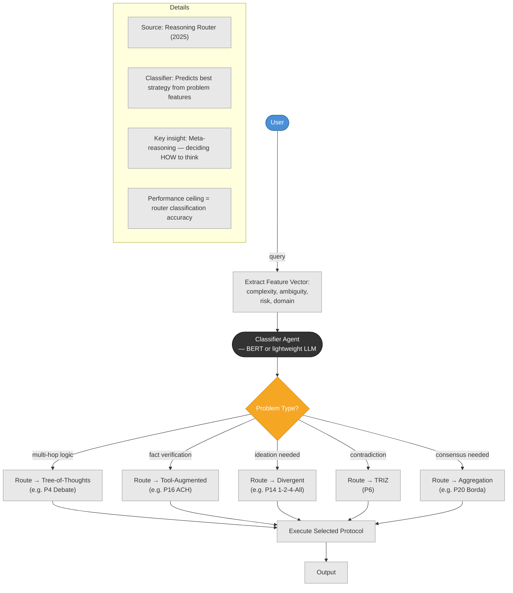
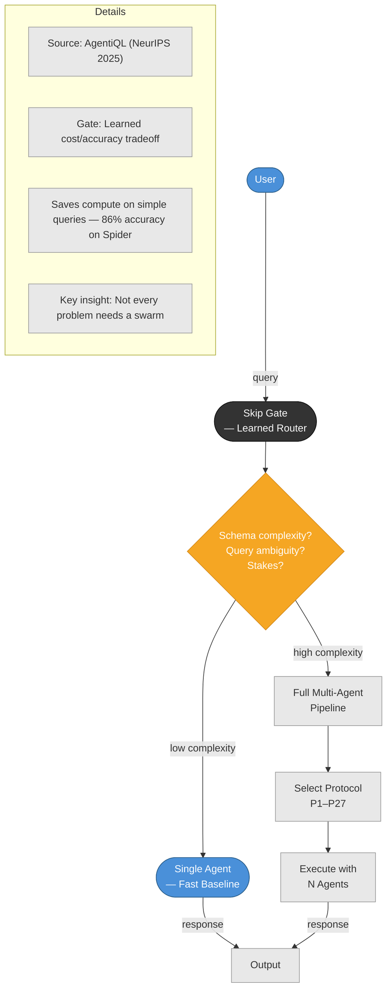
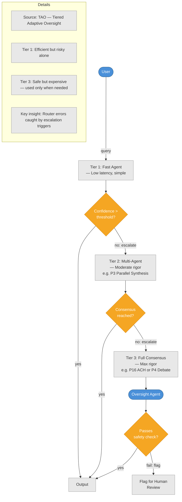
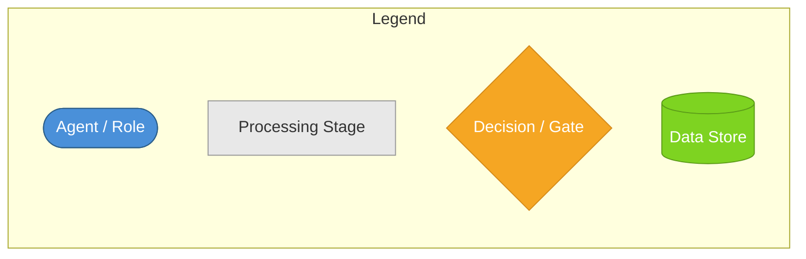
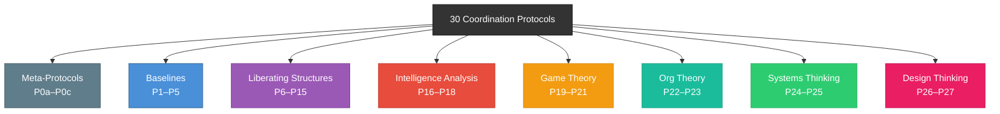

# Coordination Lab — 30 Protocol Visual Reference

---

## P0: Meta-Protocols — The Adaptive Router Layer

*These 3 patterns govern **which** of the 27 coordination protocols to run. Sourced from: Reasoning Router (2025), AgentiQL (NeurIPS 2025), TAO Framework.*

### P0a: Reasoning Router — Dynamic Strategy Selection

**A classifier agent analyzes the input problem's structural features and selects the optimal coordination protocol.**

### P0b: Cost-Aware Skip Gate — When NOT to Use Multi-Agent

**A learned router decides whether the problem warrants a full multi-agent pipeline or a simple single-agent response, balancing accuracy vs. cost.**

### P0c: Tiered Escalation — Cascading Protocols on Failure

**Routes queries to the simplest adequate tier first. If confidence is low or errors detected, escalates to progressively more rigorous protocols.**

---

## Legend

**Arrow labels** indicate data or artifacts flowing between stages.

## Category Map

## Color Coding

| Category | Color | File |
|---|---|---|
| Meta-Protocols | Gray `#607D8B` | [00-overview.md](00-overview.md) (above) |
| Baselines | Blue `#4A90D9` | [01-baselines.md](01-baselines.md) |
| Liberating Structures | Purple `#9B59B6` | [02-liberating-structures.md](02-liberating-structures.md) |
| Intelligence Analysis | Red `#E74C3C` | [03-intelligence-analysis.md](03-intelligence-analysis.md) |
| Game Theory | Orange `#F39C12` | [04-game-theory.md](04-game-theory.md) |
| Org Theory | Teal `#1ABC9C` | [05-org-theory.md](05-org-theory.md) |
| Systems Thinking | Green `#2ECC71` | [06-systems-thinking.md](06-systems-thinking.md) |
| Design Thinking | Pink `#E91E63` | [07-design-thinking.md](07-design-thinking.md) |

## Full Protocol Index

| # | Protocol | Category | Agents | Key Mechanism |
|---|---|---|---|---|
| P0a | Reasoning Router | Meta-Protocol | 1 classifier | Classify problem features → select protocol |
| P0b | Cost-Aware Skip Gate | Meta-Protocol | 1 gate | Decide: single-agent vs. full pipeline |
| P0c | Tiered Escalation | Meta-Protocol | 1+ per tier | Tier 1 → Tier 2 → Tier 3 on failure |
| P1 | Single Agent | Baselines | 1 | Direct response |
| P2 | Single + Context | Baselines | 1 | Role context injection |
| P3 | Parallel Synthesis | Baselines | N+1 | Independent → merge |
| P4 | Multi-Round Debate | Baselines | N+1 | Argue → judge |
| P5 | Constraint Negotiation | Baselines | N+1 | Propose → filter → iterate |
| P6 | TRIZ Inversion | Liberating Structures | N+1 | Failure → invert |
| P7 | Wicked Questions | Liberating Structures | N+1 | Surface paradoxes |
| P8 | Min Specs | Liberating Structures | N+1 | Eliminate non-essentials |
| P9 | Troika Consulting | Liberating Structures | 3 | Client + consultants |
| P10 | HSR | Liberating Structures | N | Empathy translation |
| P11 | DAD | Liberating Structures | N+1 | Positive deviants |
| P12 | 25/10 Crowd Sourcing | Liberating Structures | N+1 | Blind scoring |
| P13 | Ecocycle Planning | Liberating Structures | N+1 | Lifecycle mapping |
| P14 | 1-2-4-All | Liberating Structures | N+1 | Progressive merging |
| P15 | What/So What/Now What | Liberating Structures | N+1 | Temporal frames |
| P16 | ACH | Intelligence Analysis | N+1 | Evidence matrix |
| P17 | Red/Blue/White Team | Intelligence Analysis | 3+ | Attack/defend/referee |
| P18 | Delphi Method | Intelligence Analysis | N+1 | Iterative convergence |
| P19 | Vickrey Auction | Game Theory | N+1 | Second-price bid |
| P20 | Borda Count | Game Theory | N+1 | Ranked aggregation |
| P21 | Interests-Based Negotiation | Game Theory | N+1 | Mutual gains |
| P22 | Sequential Pipeline | Org Theory | N | Chain processing |
| P23 | Cynefin Probe-Sense-Respond | Org Theory | N+1 | Domain classification |
| P24 | Causal Loop Mapping | Systems Thinking | N+1 | Feedback loops |
| P25 | System Archetype Detection | Systems Thinking | N+1 | Pattern matching |
| P26 | Crazy Eights | Design Thinking | N+1 | Constrained divergence |
| P27 | Affinity Mapping | Design Thinking | N+1 | Embedding clusters |
