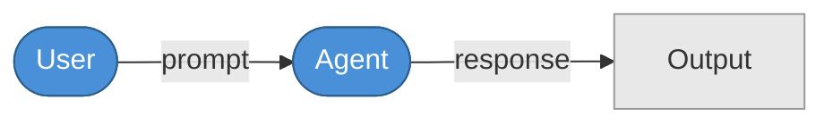
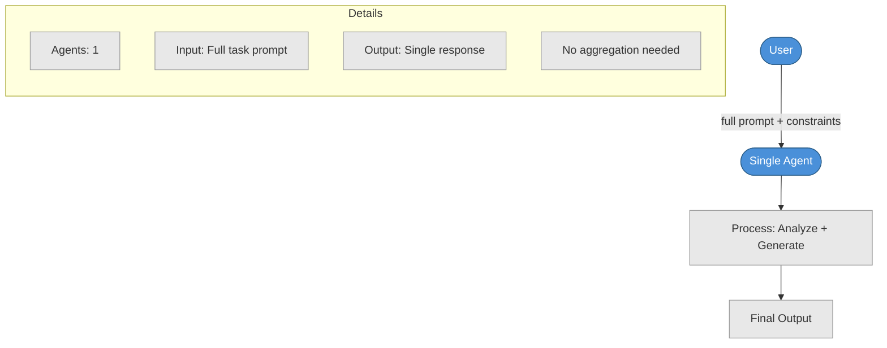
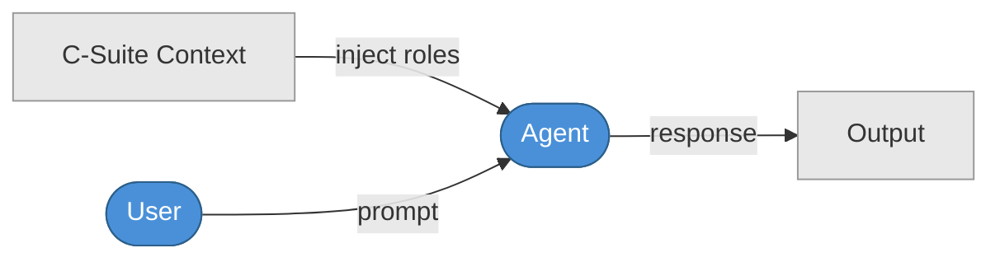
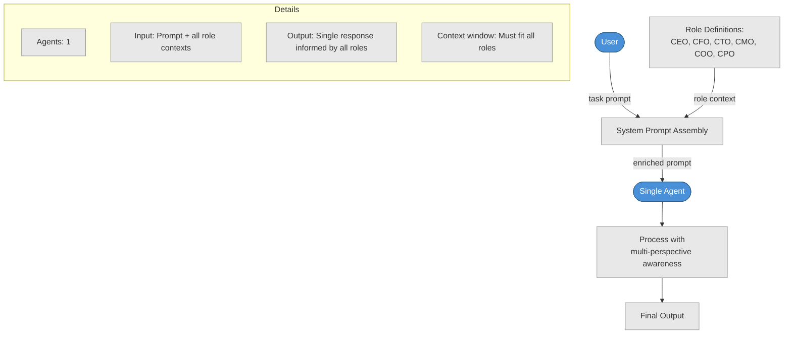
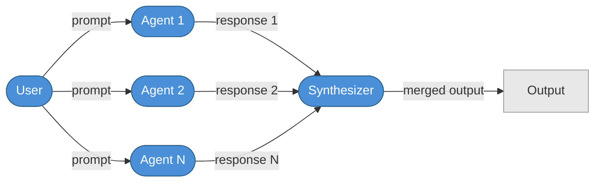
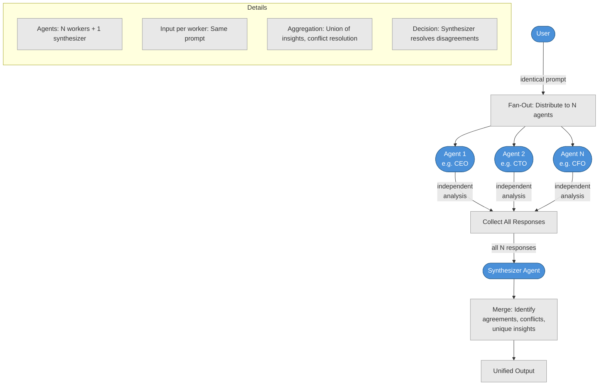
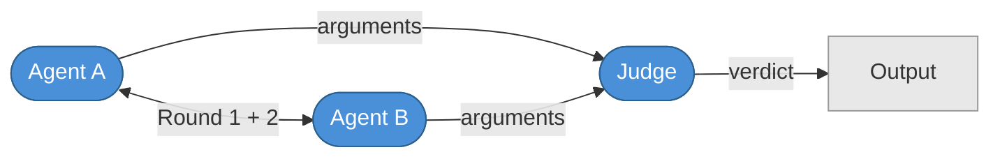
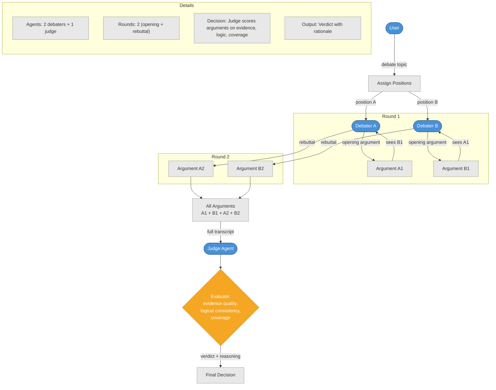
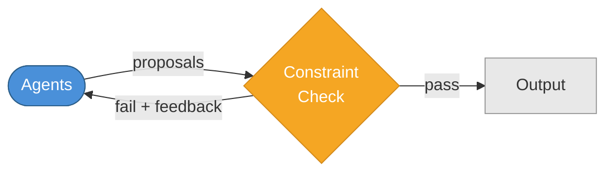
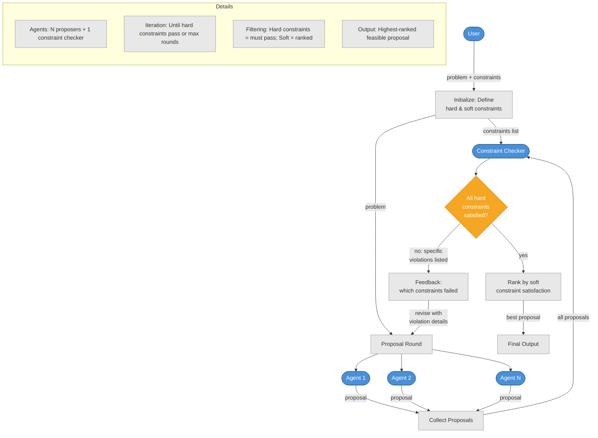

# Baselines (P1–P5)

## P1: Single Agent

**One agent receives the full prompt and produces a single response.**

### Summary Flow

### Detailed Mechanics

---

## P2: Single Agent + Context

**One agent with all C-Suite role context injected into system prompt.**

### Summary Flow

### Detailed Mechanics

---

## P3: Parallel Synthesis

**N agents work independently on the same prompt, then a synthesizer merges results.**

### Summary Flow

### Detailed Mechanics

---

## P4: Multi-Round Debate

**Agents argue positions across 2 rounds, then a judge decides.**

### Summary Flow

### Detailed Mechanics

---

## P5: Constraint Negotiation

**Agents propose solutions, a constraint checker filters them, iterate until convergence.**

### Summary Flow

### Detailed Mechanics

