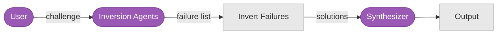

# Liberating Structures (P6–P15)

## P6: TRIZ Inversion

**"What would guarantee failure?" — then invert to find solutions.**

### Summary Flow



### Detailed Mechanics


---

## P7: Wicked Questions

**Surface irresolvable paradoxes to sharpen strategic tensions.**

### Summary Flow


### Detailed Mechanics

```mermaid
graph TB
    U([User]):::agent -->|"strategic topic"| FRAME[Frame: Identify<br/>competing demands]:::stage

    FRAME --> A1([Agent 1]):::agent
    FRAME --> A2([Agent 2]):::agent
    FRAME --> AN([Agent N]):::agent

    A1 -->|"tension pairs"| COLLECT[Collect All Tensions]:::stage
    A2 -->|"tension pairs"| COLLECT
    AN -->|"tension pairs"| COLLECT

    COLLECT --> TEST{Wickedness Test:<br/>1. Both sides true?<br/>2. Cannot choose one?<br/>3. Creates real tension?}:::decision
    TEST -->|"pass all 3"| FORMAT[Format as<br/>"How is it that X AND Y?"]:::stage
    TEST -->|"fail"| DISCARD[Discard: Not<br/>truly wicked]:::stage

    FORMAT --> RANK[Rank by<br/>strategic relevance]:::stage
    RANK --> O[Top Wicked Questions]:::stage

    subgraph Details
        D1["Agents: N generators + 1 evaluator"]:::stage
        D2["Input: Strategic topic or challenge"]:::stage
        D3["Filter: 3-part wickedness test"]:::stage
        D4["Output: Ranked paradoxes in question form"]:::stage
    end

    classDef agent fill:#9B59B6,stroke:#7D3C98,color:#fff
    classDef stage fill:#E8E8E8,stroke:#999,color:#333
    classDef decision fill:#F5A623,stroke:#D48A1A,color:#fff
```

---

## P8: Min Specs

**Generate constraints, then progressively eliminate non-essential ones.**

### Summary Flow


### Detailed Mechanics


---

## P9: Troika Consulting

**Client presents problem; 2 consultants discuss while client listens; client responds.**

### Summary Flow


### Detailed Mechanics


---

## P10: Heard-Seen-Respected (HSR)

**Empathy and translation between stakeholder perspectives.**

### Summary Flow


### Detailed Mechanics


---

## P11: Discovery & Action Dialogue (DAD)

**Find positive deviants — who's already succeeding? Extract transferable practices.**

### Summary Flow


### Detailed Mechanics


---

## P12: 25/10 Crowd Sourcing

**Rapid idea generation followed by blind scoring to surface top ideas.**

### Summary Flow


### Detailed Mechanics


---

## P13: Ecocycle Planning

**Map initiatives to lifecycle stages: birth, maturity, creative destruction, renewal.**

### Summary Flow


### Detailed Mechanics


---

## P14: 1-2-4-All

**Progressive merging: solo ideation → pairs → quads → all synthesize.**

### Summary Flow


### Detailed Mechanics


---

## P15: What / So What / Now What

**Three temporal frames: observations → implications → actions.**

### Summary Flow


### Detailed Mechanics


