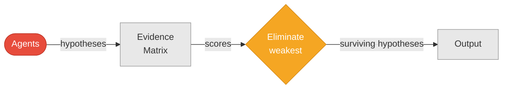

# Intelligence Analysis (P16–P18)

## P16: Analysis of Competing Hypotheses (ACH)

**Generate hypotheses, score evidence for/against each, eliminate least supported.**

### Summary Flow

### Detailed Mechanics

---

## P17: Red / Blue / White Team

**Red attacks, Blue defends, White referees.**

### Summary Flow

### Detailed Mechanics

---

## P18: Delphi Method

**Independent estimates → share reasoning → re-estimate → converge.**

### Summary Flow

### Detailed Mechanics

