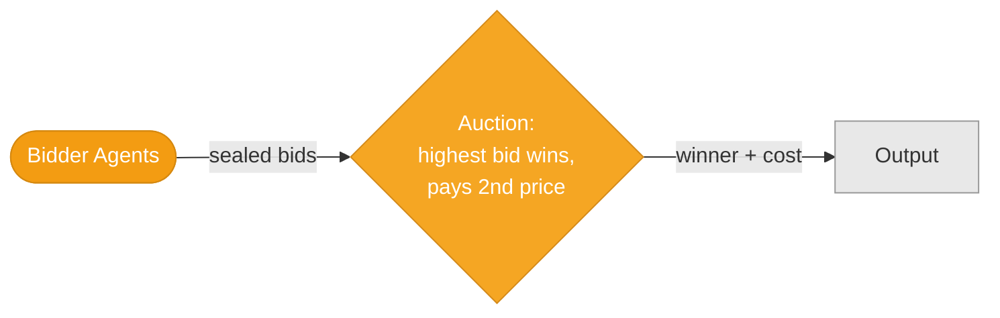
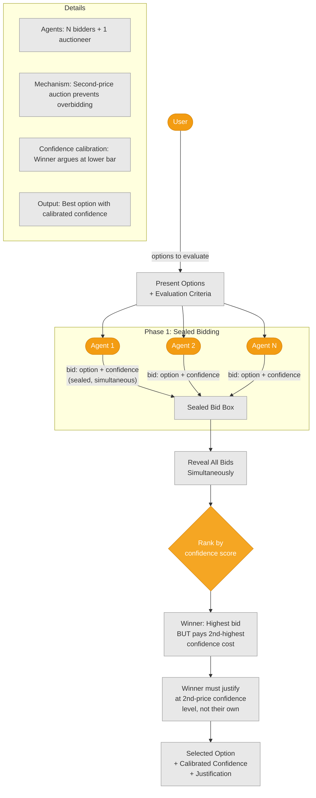
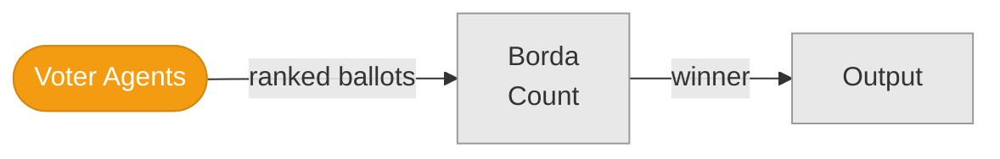
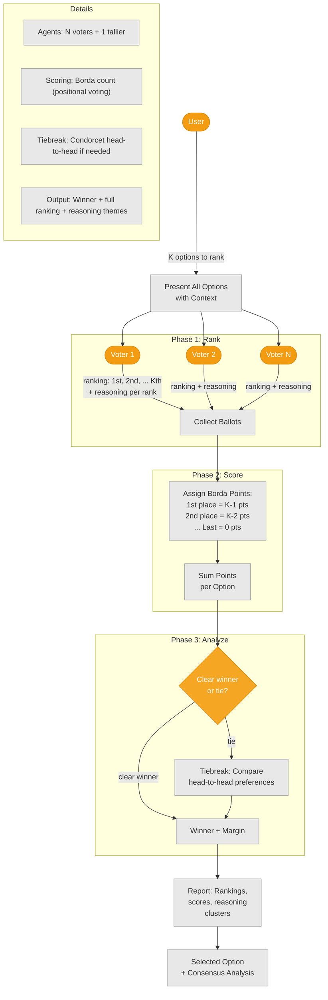
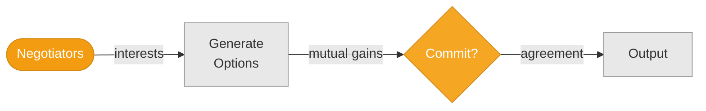
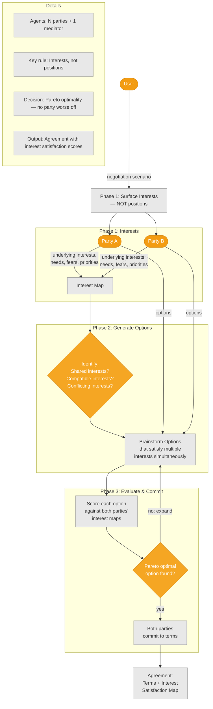

# Game Theory (P19–P21)

## P19: Vickrey Auction

**Sealed bids with confidence scores. Winner pays second-highest price. Prevents overconfidence.**

### Summary Flow

### Detailed Mechanics

---

## P20: Borda Count Voting

**Agents rank all options; points aggregated across rankings.**

### Summary Flow

### Detailed Mechanics

---

## P21: Interests-Based Negotiation

**Surface interests (not positions) → generate mutual gains → commit.**

### Summary Flow

### Detailed Mechanics

