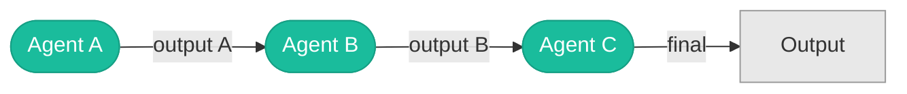
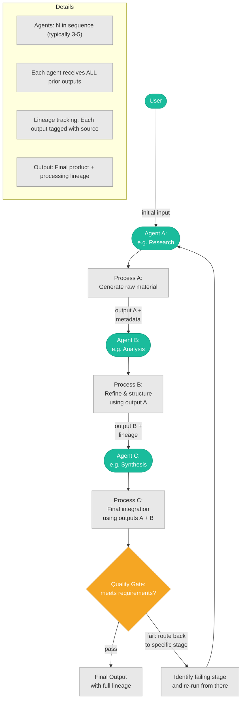
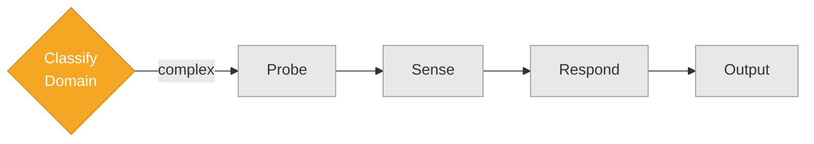
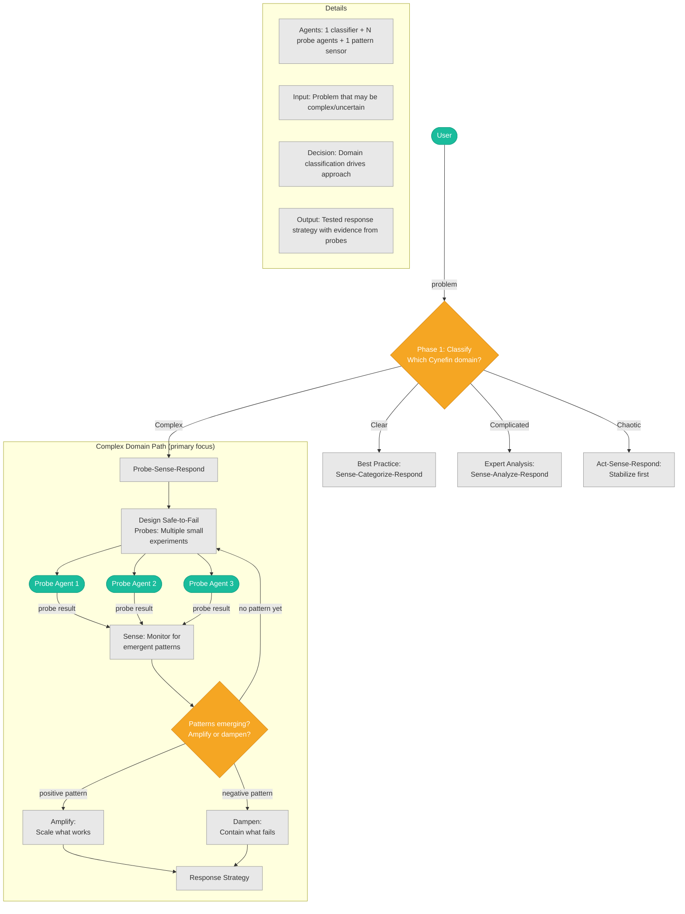

# Organizational Theory (P22–P23)

## P22: Sequential Pipeline

**Agent A → Agent B → Agent C — each builds on prior output.**

### Summary Flow

### Detailed Mechanics

---

## P23: Cynefin Probe-Sense-Respond

**Classify the problem domain → run safe-to-fail probes → sense patterns → respond.**

### Summary Flow

### Detailed Mechanics

---
