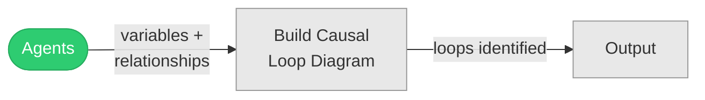
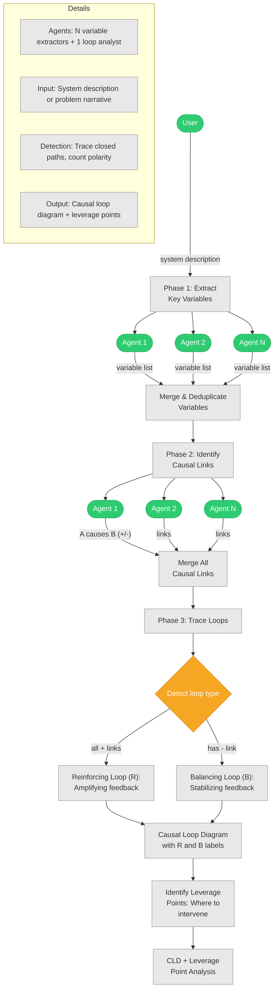
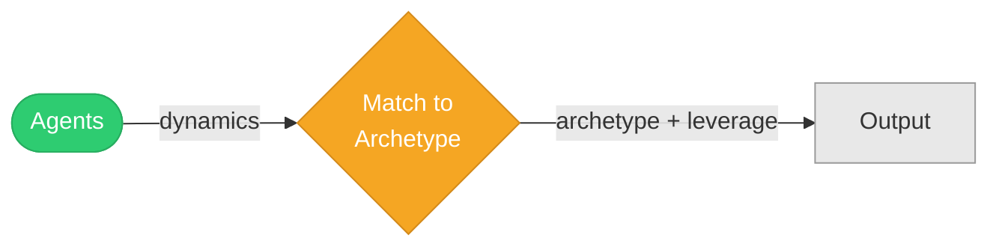

# Systems Thinking (P24–P25)

## P24: Causal Loop Mapping

**Extract variables → identify causal links → find reinforcing and balancing loops.**

### Summary Flow



### Detailed Mechanics



---

## P25: System Archetype Detection

**Match observed dynamics to known archetypes (Fixes That Fail, Shifting the Burden, etc.).**

### Summary Flow



### Detailed Mechanics

```mermaid
graph TB
    U([User]):::agent -->|"situation description"| PH1[Phase 1: Describe<br/>Observed Dynamics]:::stage

    PH1 --> A1([Agent 1]):::agent
    PH1 --> A2([Agent 2]):::agent
    PH1 --> AN([Agent N]):::agent

    A1 -->|"dynamic patterns"| DYN[Collect Observed<br/>Dynamics & Patterns]:::stage
    A2 -->|"dynamic patterns"| DYN
    AN -->|"dynamic patterns"| DYN

    DYN --> PH2[Phase 2: Compare to<br/>Known Archetypes]:::stage

    PH2 --> LIB["Archetype Library:<br/>- Fixes That Fail<br/>- Shifting the Burden<br/>- Limits to Growth<br/>- Eroding Goals<br/>- Escalation<br/>- Success to Successful<br/>- Tragedy of Commons<br/>- Growth & Underinvestment"]:::stage

    LIB --> MATCH{Match Score:<br/>How well does each<br/>archetype fit?}:::decision

    MATCH -->|"best match(es)"| EXPLAIN[Explain Match:<br/>Map situation elements<br/>to archetype structure]:::stage

    EXPLAIN --> LEVER[Archetype-Specific<br/>Leverage Points &<br/>Interventions]:::stage
    LEVER --> O[Matched Archetype(s)<br/>+ Structural Explanation<br/>+ Intervention Strategy]:::stage

    subgraph Details
        D1["Agents: N pattern observers + 1 archetype matcher"]:::stage
        D2["Input: Situation with recurring problematic dynamics"]:::stage
        D3["Library: 8+ standard system archetypes"]:::stage
        D4["Output: Best-fit archetype + structural map + interventions"]:::stage
    end

    classDef agent fill:#2ECC71,stroke:#27AE60,color:#fff
    classDef stage fill:#E8E8E8,stroke:#999,color:#333
    classDef decision fill:#F5A623,stroke:#D48A1A,color:#fff
```

---
