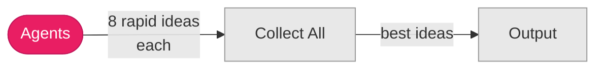
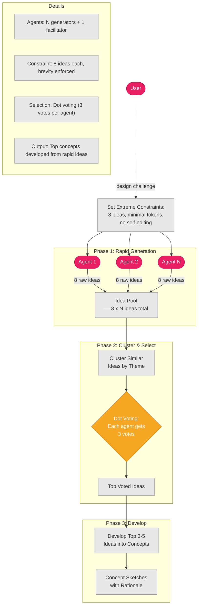
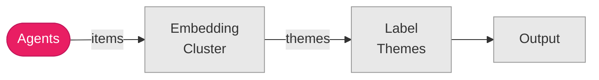
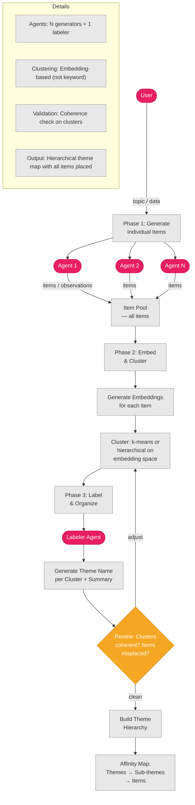

# Design Thinking (P26–P27)

## P26: Crazy Eights

**8 ideas under extreme time/resource constraints — forces radical divergence.**

### Summary Flow

### Detailed Mechanics

---

## P27: Affinity Mapping

**Generate items → embedding-based clustering → theme labeling.**

### Summary Flow

### Detailed Mechanics

